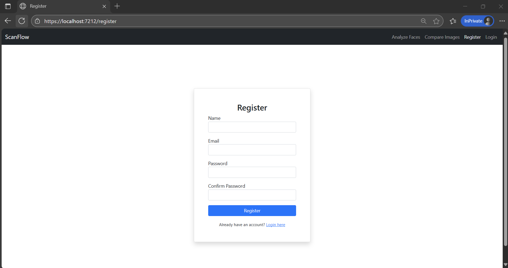
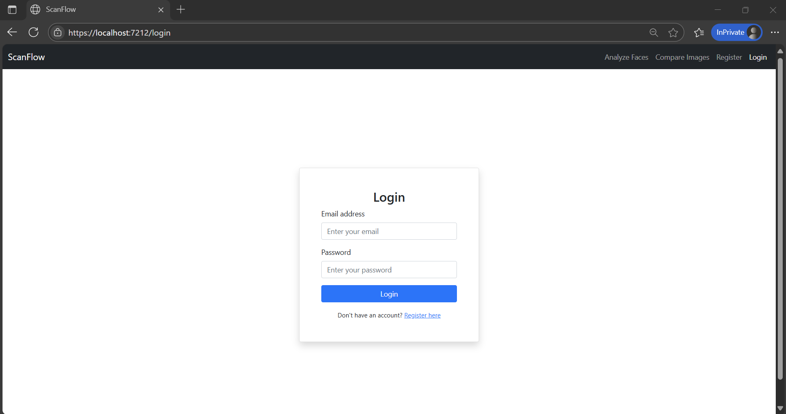
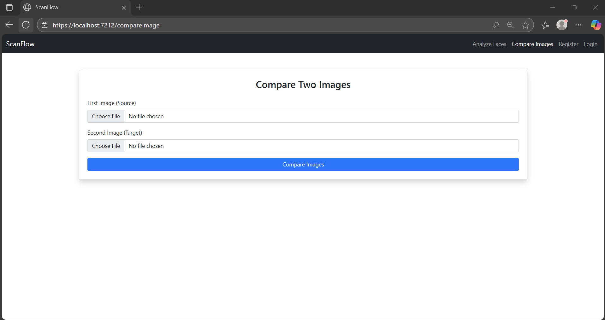
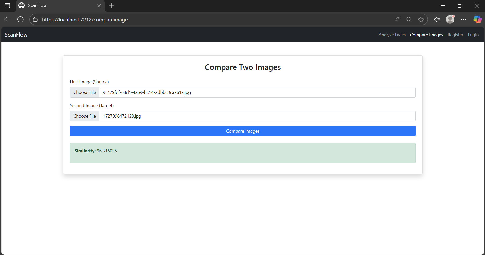

# ScanFlow

**ScanFlow** é uma aplicação full stack em **.NET** com **Blazor WebAssembly** no frontend e **ASP.NET Core Web API** no backend, seguindo os princípios de **DDD (Domain-Driven Design)**.  
O sistema permite **análise de faces e comparação de imagens** utilizando o serviço **AWS Rekognition**, com autenticação segura via **JWT** e suporte a **refresh tokens**.

O frontend é construído com **Blazor WebAssembly**, utilizando **Bootstrap** para estilização.

---

## 🧰 Tecnologias Utilizadas

### Backend
- **.NET 8**
- **ASP.NET Core Web API**
- **AWS Rekognition**
- **JWT Authentication**
- **BCrypt**
- **Entity Framework Core**
- **AutoMapper**
- **FluentValidation**
- **SQL Server**
- **Git/GitHub**

### Frontend
- **Blazor WebAssembly**
- **Bootstrap**
- **Blazored.FluentValidation**

---

## ⚙️ Funcionalidades

### Autenticação e Usuários
- Registro de usuários com validação de credenciais.
- Login com JWT e refresh tokens.
- Atualização de tokens de acesso via refresh token.

### Análise de Faces
- Upload de imagens para análise facial individual.
- Comparação de duas imagens para verificar semelhança.
- Integração com **AWS Rekognition** para detecção e comparação de faces.
- Resultados exibidos no frontend Blazor de forma interativa.

### Frontend Blazor
- Interface responsiva usando **Bootstrap**.
- Comunicação com a API backend via **HttpClient**.

---

## 🔗 Endpoints Principais do Backend

### Usuários
- `POST /api/user/register` → Registrar um novo usuário.  
- `POST /api/user/login` → Autenticar usuário e gerar JWT.  

### Tokens
- `POST /api/token/refresh` → Atualizar token de acesso usando refresh token.

### Rekognition
- `POST /api/rekognition/analyzefaces` → Analisar características faciais de uma imagem.  
- `POST /api/rekognition/compareimages` → Comparar duas imagens para verificar semelhança.  

---

## 🖼️ Telas da Aplicação

### 🧾 Registro de Usuário

### 🔑 Login

### 📸 Análise de Imagem

### 🔍 Comparação de Imagens

---
